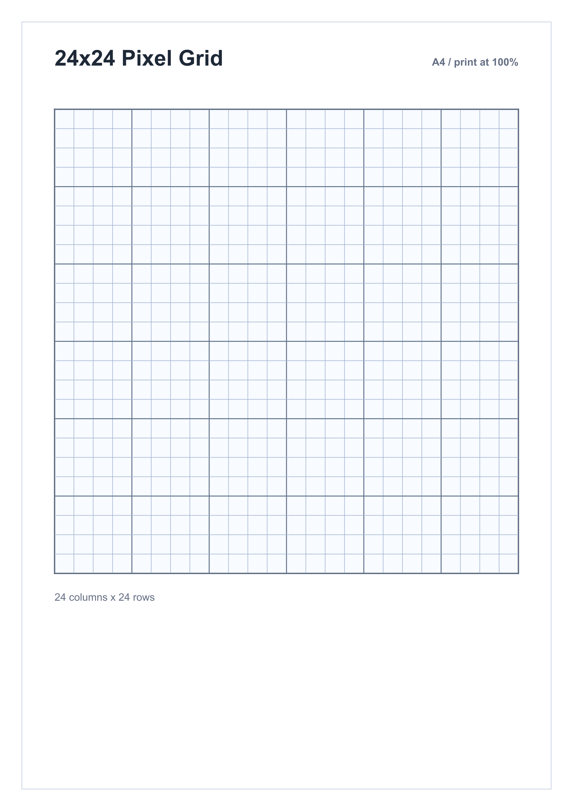

# Module 2 - Image Basics

## Learning Objective

Understand the fundamental concepts of digital images, including pixels, resolution, dimensions, color channels, and image color models used in Computer Vision and OpenCV.

## Table of Contents

1. Pixels
2. Resolution
3. Width & Height
4. Channels
5. RGB Color Model
6. BGR Color Model
7. Grayscale Images
8. Alpha Channel
9. Summary Table
10. Practice Questions

## 1. Pixels

### What is a Pixel?

A **pixel** (Picture Element) is the smallest unit of a digital image.

Every digital image is made up of thousands or millions of tiny square pixels.

Each pixel stores color information.

### Visual Representation

## Pixel Grid




### Example

Imagine this tiny 5 × 5 image.

```text
■ ■ ■ ■ ■
■ □ □ □ ■
■ □ ■ □ ■
■ □ □ □ ■
■ ■ ■ ■ ■
```

Each square represents one pixel.

### Pixel Values

In grayscale:

| Value | Color |
|------:|-------|
| 0     | Black |
| 128   | Gray |
| 255   | White |

### In OpenCV

```python
pixel = image
print(pixel)
```

Output:

```text
[125 210 85]
```

This means:

- Blue = 125
- Green = 210
- Red = 85

## 2. Resolution

### What is Resolution?

Resolution is the total number of pixels present in an image.

Formula:

```text
Resolution = Width × Height
```

Example:

```text
1920 × 1080 = 2,073,600 Pixels
```

Approximately 2 Megapixels (2MP).

### Visual


### Common Resolutions

| Resolution | Name |
|-----------:|------|
| 640×480    | VGA |
| 1280×720   | HD |
| 1920×1080  | Full HD |
| 2560×1440  | 2K |
| 3840×2160  | 4K |

## 3. Width & Height

Every image has two dimensions.

- Width → Number of columns
- Height → Number of rows

Example:

```text
Width = 800 pixels
Height = 600 pixels
```

Written as:

```text
800 × 600
```


### OpenCV Example

```python
import cv2

image = cv2.imread("cat.jpg")

height, width = image.shape[:2]

print(width)
print(height)
```

Output:

```text
800
600
```

## 4. Channels

A color image is composed of multiple channels.

Each channel stores intensity values.

For a color image:

- Red
- Green
- Blue

Three channels combine to create the final image.

### Visual


### OpenCV

```python
print(image.shape)
```

Output:

```text
(600, 800, 3)
```

Meaning:

- Height = 600
- Width = 800
- Channels = 3

## 5. RGB Color Model

RGB stands for:

- Red
- Green
- Blue

Almost every display uses RGB.

Each channel ranges from 0 to 255.

### RGB Cube


### Examples

#### Red

```text
(255, 0, 0)
```

#### Green

```text
(0, 255, 0)
```

#### Blue

```text
(0, 0, 255)
```

#### White

```text
(255, 255, 255)
```

#### Black

```text
(0, 0, 0)
```

## 6. BGR Color Model

Unlike most software, OpenCV stores images in BGR format.

Instead of RGB, OpenCV stores:

- Blue
- Green
- Red

### Example

RGB:

```text
(255, 0, 0) = Red
```

OpenCV:

```text
(0, 0, 255) = Red
```

### Visual


### OpenCV Example

```python
import cv2

image = cv2.imread("cat.jpg")

print(image)
```

Output:

```text
[120 200 255]
```

Meaning:

- Blue = 120
- Green = 200
- Red = 255

## 7. Grayscale

A grayscale image contains only one channel.

Each pixel stores brightness.

```text
0 -> 255
```

Black to White

### Visual


> Image Required:
> Black to White gradient
> Labels:
> - 0
> - 128
> - 255

### Advantages

- Smaller size
- Faster processing
- Easier edge detection
- Used in Computer Vision

### OpenCV

```python
gray = cv2.cvtColor(image, cv2.COLOR_BGR2GRAY)
```

Shape:

```text
(600, 800)
```

Only one channel.

## 8. Alpha Channel

The Alpha channel stores transparency information.

RGBA:

- Red
- Green
- Blue
- Alpha

### Alpha Values

| Value | Meaning |
|------:|---------|
| 0     | Fully Transparent |
| 128   | Semi Transparent |
| 255   | Fully Opaque |

### Visual


> Image Required:
> Checkerboard background
> Transparent PNG object
> Arrow showing Alpha Channel

### Example

```text
RGBA (255, 0, 0, 255) = Solid Red
RGBA (255, 0, 0, 100) = Transparent Red
```

## Summary Table

| Concept | Description |
|---------|-------------|
| Pixel | Smallest element of an image |
| Resolution | Total pixels in image |
| Width | Horizontal pixels |
| Height | Vertical pixels |
| Channels | Layers storing color |
| RGB | Red Green Blue |
| BGR | OpenCV color order |
| Grayscale | Single intensity channel |
| Alpha | Transparency channel |

## Quick Comparison

| Type | Channels |
|------|---------:|
| Grayscale | 1 |
| RGB | 3 |
| BGR | 3 |
| RGBA | 4 |


## Key Takeaways

- Every digital image is made of pixels.
- Resolution defines image quality using width × height.
- Width and Height describe image dimensions.
- Channels store color information.
- RGB is the standard color model, while OpenCV uses BGR.
- Grayscale images contain only one intensity channel.
- The Alpha Channel controls image transparency.
- Understanding these basics is essential before learning image processing techniques in OpenCV.